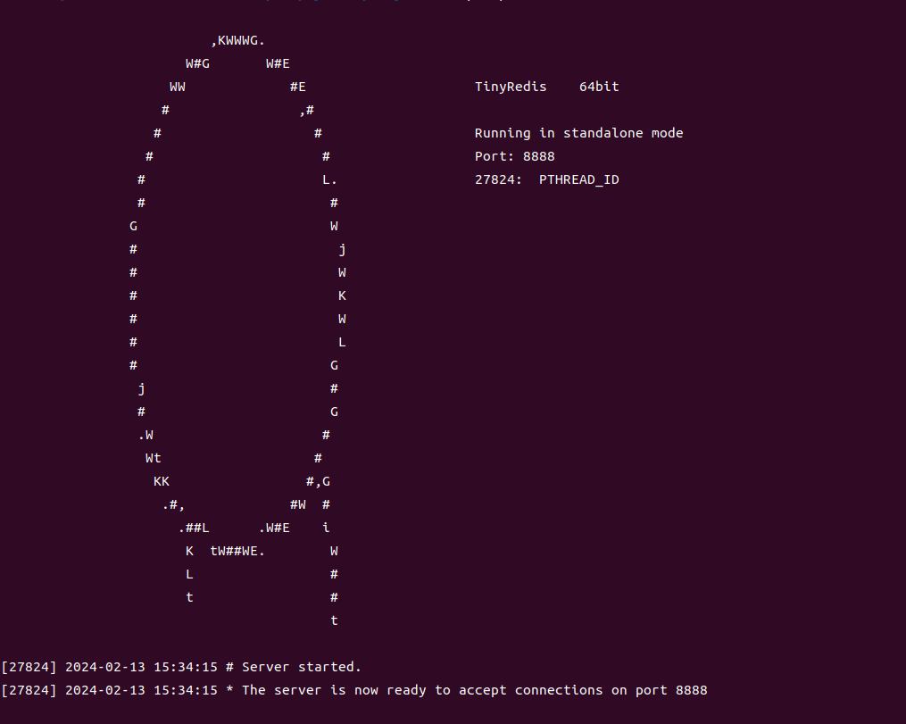
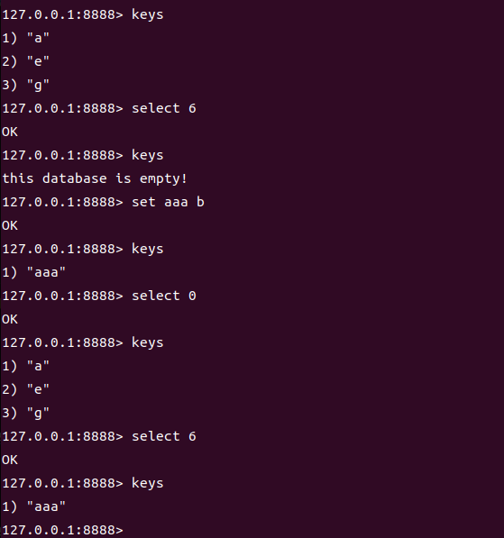
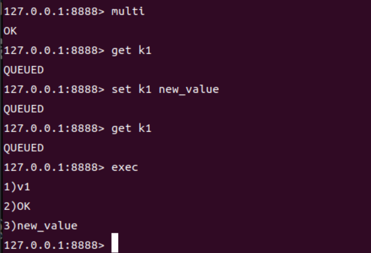
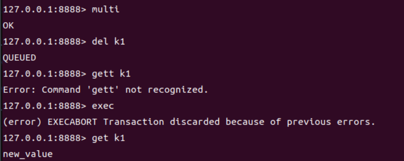
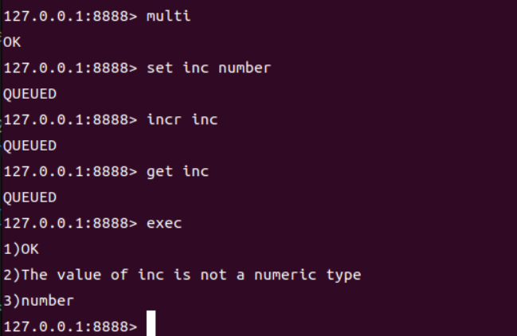
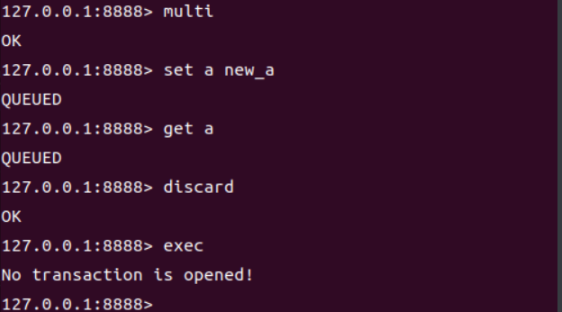
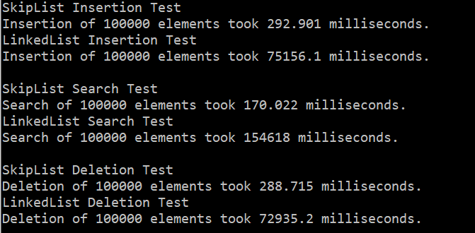

## 介绍

___

​	这是一个在Linux环境下开发的轻量级Redis实现，使用C++编写，旨在通过实践深入学习网络编程、多线程处理以及设计模式的应用。项目采用跳表作为核心数据结构，支持基本的键值存储操作。目前实现了**字符串、列表、哈希表**数据类型的数据存取、以及基本的数据库操作功能。

## 特性

___

- **数据持久化**：服务器关闭时，数据自动保存至磁盘，路径默认为"./data_files/dbxx"，支持多个数据库文件。
- **支持事务功能**：支持事务的执行和撤销，提供回滚操作。
- **Epoll**：使用Epoll进行高效的IO事件处理，提高并发处理能力。
- **线程池**：采用线程池处理客户端请求，优化资源使用和提升处理速度。
- **设计模式应用**：包括单例模式、工厂模式和享元模式，提高代码的可维护性和扩展性。
- **数据类型抽象**：支持多种数据类型，包括字符串、列表、哈希表等。

## 使用

___

### 编译

```bash
make
```

### 使用

编译完成后，在两个不同的终端中启动服务器和客户端：

启动服务器：

```bash
./server
```

启动客户端：

```bash
./client
```

之后，可以在客户端终端使用Redis支持的命令进行操作。

## 支持的指令

___

### 基础键值操作

- **SELECT**：选择数据库。用法：`SELECT <index>`。
- **SET**：设置键值对。用法：`SET <key> <value> [NX|XX]`。
- **SETNX**：如果键不存在，则设置键值对。用法：`SETNX <key> <value>`。
- **SETEX**：设置键的值，并设置过期时间。用法：`SETEX <key> <seconds> <value>`。
- **GET**：获取键的值。用法：`GET <key>`。
- **KEYS**：列出所有键。用法：`KEYS`。
- **DBSIZE**：返回当前数据库的键的数量。用法：`DBSIZE`。
- **EXISTS**：检查给定键是否存在。用法：`EXISTS <key1> [<key2> ...]`。
- **DEL**：删除给定的一个或多个键。用法：`DEL <key1> [<key2> ...]`。
- **RENAME**：重命名键。用法：`RENAME <oldKey> <newKey>`。
- **INCR**：将键的整数值增加1。用法：`INCR <key>`。
- **INCRBY**：将键的整数值增加指定量。用法：`INCRBY <key> <increment>`。
- **INCRBYFLOAT**：将键的浮点值增加指定量。用法：`INCRBYFLOAT <key> <increment>`。
- **DECR**：将键的整数值减少1。用法：`DECR <key>`。
- **DECRBY**：将键的整数值减少指定量。用法：`DECRBY <key> <decrement>`。
- **MSET**：同时设置一个或多个键值对。用法：`MSET <key1> <value1> [<key2> <value2> ...]`。
- **MGET**：获取一个或多个键的值。用法：`MGET <key1> [<key2> ...]`。
- **STRLEN**：返回键值的字符串长度。用法：`STRLEN <key>`。
- **APPEND**：如果键已存在并且值为字符串，将给定值追加到键现有值的末尾。用法：`APPEND <key> <value>`。

### 事务指令

- **MULTI**、**EXEC**、**DISCARD**：事务功能，包括事务开启、执行事务和撤销事务。

### 列表操作

- **LPUSH**：将一个值插入到列表头部。用法：`LPUSH <key> <value>`。
- **RPUSH**：将一个值插入到列表尾部。用法：`RPUSH <key> <value>`。
- **LPOP**：移除并返回列表头部的元素。用法：`LPOP <key>`。
- **RPOP**：移除并返回列表尾部的元素。用法：`RPOP <key>`。
- **LRANGE**：获取列表指定范围内的元素。用法：`LRANGE <key> <start> <end>`。

### 哈希表操作

- **HSET**：向哈希表中添加一个字段及其值。用法：`HSET <key> <field> <value>`。
- **HGET**：获取哈希表中指定字段的值。用法：`HGET <key> <field>`。
- **HDEL**：删除哈希表中的一个或多个指定字段。用法：`HDEL <key> <field1> [<field2> ...]`。
- **HKEYS**：获取哈希表中的所有字段名。用法：`HKEYS <key>`。
- **HVALS**：获取哈希表中的所有值。用法：`HVALS <key>`。

## 项目文件介绍

___

​	项目采用模块化设计，主要包括客户端、服务端、命令解析、事件管理、辅助工具等模块。

以下是项目的目录结构及文件说明：

```
src
├── client.cpp                  # 客户端启动逻辑，处理用户输入并与Redis服务器通信。
├── CommandParser.cpp           # 命令解析器实现文件，解析客户端命令。
├── CommandParser.h             # 命令解析器头文件，定义命令解析相关类和方法。
├── EpollManager.cpp            # 基于Epoll的事件管理器实现文件，处理网络IO事件。
├── EpollManager.h              # Epoll事件管理器头文件，定义事件管理相关类和方法。
├── FileCreator.h               # 数据库文件创建和管理的头文件。
├── global.h                    # 存放全局变量和定义，如支持的命令列表。
├── ParserFlyweightFactory.cpp  # 命令解析器享元工厂实现文件，优化命令解析器的创建和复用。
├── ParserFlyweightFactory.h    # 命令解析器享元工厂头文件，定义享元工厂相关类和方法。
├── RedisClient.cpp             # Redis客户端实现文件，用于与服务器进行通信和数据交换。
├── RedisClient.h               # Redis客户端头文件，定义客户端相关类和方法。
├── RedisHelper.cpp             # 提供数据库操作的辅助函数实现文件。
├── RedisHelper.h               # 数据库操作辅助函数头文件。
├── RedisServer.cpp             # Redis服务端主逻辑实现文件，包括客户端连接管理和请求处理。
├── RedisServer.h               # Redis服务端头文件，定义服务端相关类和方法。
├── RedisValue                  # Redis数据类型对象模块，处理不同类型的Redis数据类型。
│   ├── Dump.h                  # Redis数据导出头文件。
│   ├── Global.h                # Redis数据类型对象模块的全局定义头文件。
│   ├── Parse.cpp               # Redis数据类型解析实现文件。
│   ├── Parse.h                 # Redis数据类型解析头文件。
│   ├── RedisValue.cpp          # Redis数据类型对象实现文件。
│   ├── RedisValue.h            # Redis数据类型对象头文件，定义值对象相关类和方法。
│   └── RedisValueType.h        # 定义Redis数据类型类型的头文件。
├── server.cpp                  # 服务端启动逻辑，初始化服务器并开始接受客户端连接。
├── SkipList.h                  # 跳表数据结构实现头文件，支持高效的数据操作。
└── ThreadPool.h                # 线程池实现头文件，用于并发处理客户端请求。
```

## 运行效果

___

### 服务端



### 客户端

#### 基本功能演示



#### 事务功能演示

1. 事务正确执行

   

2. 语法错误（编译器错误），回退操作

   

3. 运行时错误,事务不回滚，而是跳过错误命令继续执行。

   

4. 撤销事务

   

## 压力测试：跳表vs单向链表

___

### 测试方法

对比两种数据结构在插入、查询和删除操作上的性能。

1. **测试数据准备**：使用统一的随机数生成方法，为每个测试生成大量的整数键值对。测试数据集大小为N个元素，以确保测试的公平性和一致性。
2. **插入测试**：分别向跳表和单链表中插入N个元素，并记录操作耗时。
3. **查询测试**：随机选择N个元素的键，分别在跳表和单链表中进行查询，并记录操作耗时。
4. **删除测试**：随机选择N个元素的键，分别在跳表和单链表中进行删除，并记录操作耗时。

此实验的N设置为**100000**

### 进行测试

```
cd StressTest
make
./test
```

### 测试结果



结果分析：跳表在插入、查询和删除这三种基本操作上都**显著优于**单链表。这得益于跳表的层次索引结构，使得即使在大数据量下也能保持较高的操作效率。跳表特别适用于需要频繁执行查找操作的场景，而其在插入和删除操作上的性能也非常出色。

## 待改进和优化的点

___

- [x] 使用epoll优化网络模型，支持更高的并发连接数。
- [x] 增加哈希表、列表等元素
- [x] 增加事务功能
- [ ] 增加更多的数据库操作命令，丰富数据库功能。
- [ ] 实现更复杂的数据持久化策略，如AOF或RDB。
- [ ] 增加配置文件支持，允许自定义数据库配置。
- [ ] 引入日志系统记录历史指令。

## 参考

___

1. [Skiplist-CPP](https://github.com/youngyangyang04/Skiplist-CPP.git) ：参考跳表类的成员方法。
2. [力扣 1206. 设计跳表](https://leetcode.cn/problems/design-skiplist/) ：学习跳表的实现。
3.  [json11](https://github.com/dropbox/json11) :参考如何将数据类型抽象。

